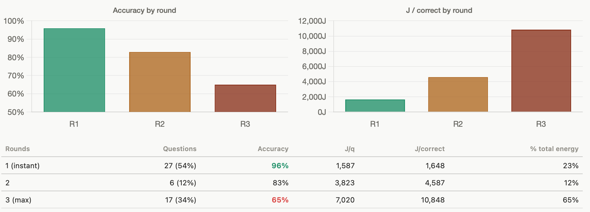
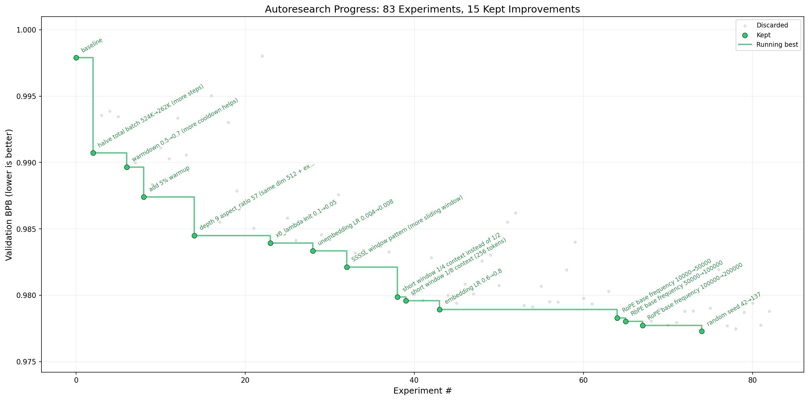

I got access to ~$500,000 worth of NVIDIA B200 compute last weekend, at the SemiAnalysis x Fluidstack Hackathon for GTC. With it, Sabareesh (my hackathon partner) and I had tons of fun running as many things as we could with temporary cluster access.

My goal was to really understand agents top to bottom and the new hype around surrounding agentic dev tools, learning to set up agents and hammer them with throughput experiments on the B200. My project, therefore, was not a hack that closed some loop with an interesting demo, it was a series of batch experiments I used to follow my curiosity and intuition in using agents. Besides learning different inference tools and technologies, my experiments showed me the decision capacity that co-operative agents can bring at scale, but also the horrible shortcomings of badly designed systems.

Unexpectedly, this hackathon shoved in my face the step function in general productivity that AI tools provide. Before this hackathon, I had heard praise of Claude Code, and now I'm a true believer. I'm still experimenting with how best to use it, but now I'm convinced that AI agents controlling *the computer* and doing computer tasks will be a massive unlock for the general public. Set up correctly, and used with an intuition for the task, it truly felt like a bicycle for the mind.

## Our Hacks

Over the scope of the three days, my partner and I worked on two interesting ideas. The first one we worked on was getting AI models to make decisions about scenarios taking the least amount of energy. Datacenter energy requirements are the biggest constrained resource in the next 10 years, according to SemiAnalysis's own post.

I wanted to figure out the energy and cost efficiency tradeoffs to outsource decision making to AI agents. This was motivated by a book I read, *Nexus*, that painted a grim picture of democracy with AI agents. I analyzed my experiments with Claude, and uploaded them [here](https://claude.ai/public/artifacts/1f413097-8104-4b9f-b3f5-cb3244a578cf).

We had a couple interesting results. First is that chain of thought and decoding tokens consume far more energy than we anticipated. When multiple agents are talking through a problem and reaching an agreement, if they don't know the answer to the question quickly, consensus does not help. **Idiots don't make idiots smarter. Bureaucracy doesn't save these agents either.**

The second one was mostly the work of my partner Sabareesh, who took Andrej Karpathy's [auto-research project](https://github.com/karpathy/autoresearch) and scaled it up to run on 8 top of the line B200 GPUs. Learning about this project, and seeing Sabareesh set it up so quickly, did two things for me. First it mesmerized me and showed how useless my AI workflows were, and it cemented in my mind (along with talking with many people about their hacks) where all of this is going: closing the loop between dataset generation/cleaning, hyperparameter tuning, and post-training fine tuning, into a self-improving AI loop. AGI is a term I need to be careful throwing around, but we are approaching cognitive growth loops so much faster than I anticipated.

Hyperparameters are merely one part of an LLM's structure. And if hyperparameter search can be done with an AI agent, that's fundamental evidence that AI agents can recreate the step functions we see with technological progress, and even evolution on larger timescales.

## The Power of AI Tools

It's interesting that the journey to arriving at a decision to dedicate a significant amount of your life to a hobby/pursuit starts with someone whooping your ass. Not always literally, but in a way that the gap is unmistakable and the process to get there is clear but the only thing missing is experience. That's how I felt about watching other people work with AI agents at the hackathon. One person had the Claude max subscription running multiple 24/7 agents, another showed me their openclaw workflows that they can text their agent to move things around on their calendar. One person showed me their email agent that does outreach based on a shared google doc.

However, the experience that really kicked my ass was seeing Sabareesh right next to me take a project off of GitHub designed to run on a single GPU, modify it in 10 minutes to work in parallel on multiple GPUs, and deploy it on a completely fresh HPC user 10 minutes later. In a hackathon pre-AI, that would've been the entire damn 48 hours.

Seeing all of this together made something clear to me: my biggest takeaway didn't come from the raw compute, or even the models themselves. It was realizing that **the bottleneck is shifting away from capability and towards direction.**

With the right setup, these systems can already do an incredible amount of work. But without good orchestration, intuition, and taste, they burn through energy and compute with surprisingly little to show for it.

I went into the hackathon trying to understand agents as a concept, maybe walk out with some description of what I did. I left realizing that the real skill and pursuit for my next decade is learning how to work with agents — how to direct them, structure them, and think alongside them.

That's a life skill worth compounding.
