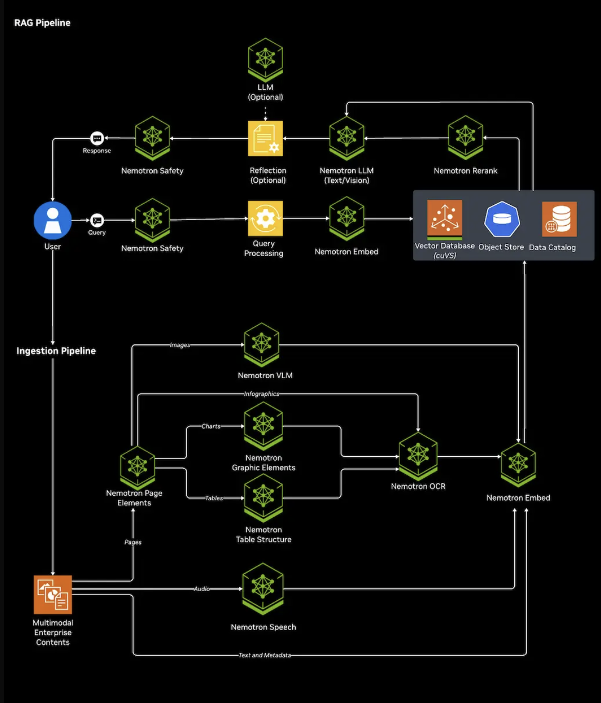
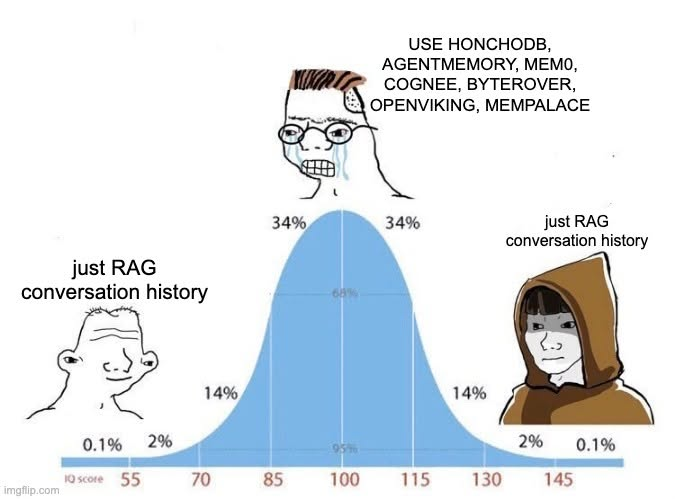

I need to squeeze as much intelligence out of my data as I can without evaporating the ocean or my wallet.

The AI labs have done the heavy lifting for me by shoving the entire internet into their models, but the data required to tailor the experience to me is not being used to it's potential.

Right now, my main interface with AI is claude code. It opens a session, reads files, calls tools, runs skills, all at an extremely slow pace. I'm in the process of building out my second brain, where hundreds of notes a day are written, read, marked stale by different sessions. This is the recommended quickstart system that people have poured hundreds of hours of work notes into. Anyone with a library large enough generally runs into the same problems:

* It's hard for the agent to draw the full context of a project from disparate notes
* There's a large number of stale notes that are hard to clean up later
* Different kinds of data, like diagrams, screenshots, images, pdfs are hard to parse and understand in context by your agents

These problems are the foundational problems of context engineering: how do you get an AI agent to collect the correct context quickly and accurately.

That is why enterprise systems are moving toward agentic retrieval: the model gets tools like search, open, find, summarize, compare, and query, then iteratively hunts for evidence instead of accepting one fixed retrieval result. The enabling technology is an AI Query Engine.

Enterprise systems though, spare no expense.

Is this system even useful? It's a lot of work to be doing all this, and probably not useful until I have multiple hundreds of gigabytes to ingest. The only thing I know for sure, is that if I want my agents to be the most reliable they can be, and for me to be the most proud of them, they need a proper context setup. To upgrade my second brain game, I have to get on this agentic RAG wave and start getting more reliable context retrieval reps.

For my system, I might consider a local RAG that runs on my macbook pro. I've also been looking into running a local model like Mistral-7B-Instruct, and a system like https://github.com/itsmostafa/qi but with more github stars would be nice.

